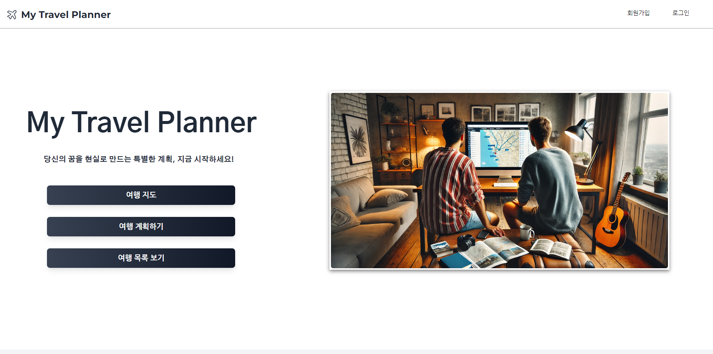

# CRM Service Project 

* My Travel Planner

  

  배포 URL: https://myplanner.guswldaiccproject.com

  
  Test_ID : Test@gmail.com

  TEST_PW : 12345

# 1. 프로젝트 소개 & 목적

### 프로젝트 소개
  
  *  AI를 통해 여행 계획을 작성하는 웹은 있습니다.
  
  
  *  사용자가 달력으로 여행 날짜, 장소, 정보 작성 하는 웹은 없습니다.
  

  * 여행 계획 뿐만 아니라 사용자가 방문했던 장소를 사진을 등록하고 여행 정보를 작성 할 수 있는 시스템

### 프로젝트 목적

  * 구글 지도 제공하여 로드맵 확인 가능

  * 일정 계획을 통해 캘린더에서 날짜를 선택하여 목록 생성

  * 여행 장소를 시 우측에 내가 적었던 여행 정보 표현, 수정 및 삭제 가능

# 2. 개발 환경
