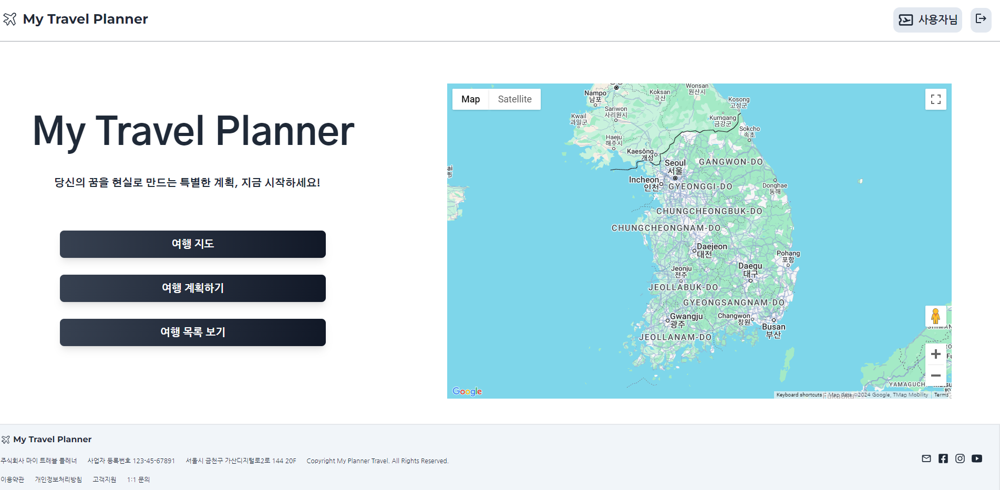
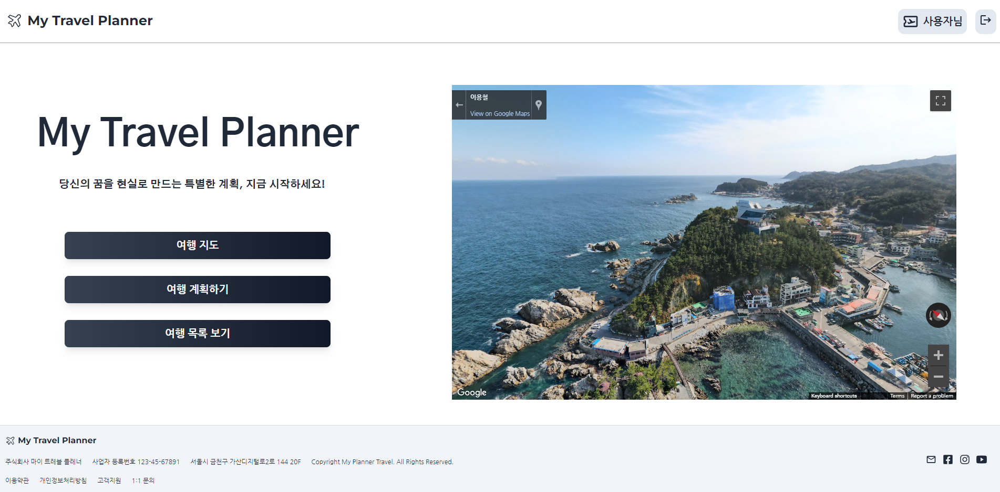

# CRM Service Project 

* My Travel Planner

<p align="center">
  
</p>

<P align="justify">
  배포 URL: https://myplanner.guswldaiccproject.com

  
  Test_ID : Test@gmail.com


  TEST_PW : 12345


</p>

# 1. 프로젝트 소개 & 목적


### 프로젝트 소개
  
  *  AI를 통해 여행 계획을 작성하는 웹은 있습니다.
  
  
  *  사용자가 달력으로 여행 날짜, 장소, 정보 작성 하는 웹은 없습니다.
  

  * 여행 계획 뿐만 아니라 사용자가 방문했던 장소를 사진을 등록하고 여행 정보를 작성 할 수 있는 시스템


### 프로젝트 목적

  * 구글 지도 제공하여 로드맵 확인 가능


  * 일정 계획을 통해 캘린더에서 날짜를 선택하여 목록 생성


  * 여행 장소를 시 우측에 내가 적었던 여행 정보 표현, 수정 및 삭제 가능


# 2. 개발 환경

* 기술 스택

```
📦 Front - React App
├── 📂 .github
│   └── 📂 workflows
│       └── cicd.yml (CI/CD 파이프라인 설정 파일)
│
├── 📂 build
│   └── (빌드된 파일들)
│
├── 📂 node_modules
│   └── (의존성 모듈들)
│
├── 📂 public
│   └── (정적 파일들)
│
├── 📂 src
│   ├── 📂 Component
│   │   ├── 📂 Auth
│   │   │   └── (인증 관련 컴포넌트)
│   │   ├── 📂 Home
│   │   │   └── (홈 페이지 컴포넌트)
│   │   ├── 📂 Calendarpage
│   │   │   └── (캘린더 페이지 컴포넌트)
│   │   ├── 📂 Map
│   │   │   └── (지도 관련 컴포넌트)
│   │   ├── 📂 Planner
│   │   │   └── (플래너 관련 컴포넌트)
│   ├── Apps.js
│   └── Index.css
│
├── dockerfile
│   └── (Docker 설정 파일)
│
├── nginx.conf
│   └── (Nginx 설정 파일)
│
├── package.json
│   └── (의존성 및 프로젝트 정보)
│
└── README.md

```

# 3. 구현 기능

* Google 지도 구현하여 여행 계획 참고

<p align="center">
  
</p>


* Google 지도 로드맵 기능 지원

<p align="center">
  
</p>

```
const containerStyle = {
  width: '50%', // 컨테이너 너비 설정
  height: '600px', // 컨테이너 높이 설정
  marginLeft: '5%', // 왼쪽 여백 설정
};

// 한반도의 중심 위치 (위도, 경도)
const center = {
  lat: 36.5, // 한반도 중심 위도
  lng: 127.5, // 한반도 중심 경도
};

const GoogleMapComponent = () => {
  // Google Maps API 로딩 상태 확인
  const { isLoaded } = useJsApiLoader({
    id: 'google-map-script', // 스크립트 ID
    googleMapsApiKey: process.env.REACT_APP_MAP_API_KEY, // 환경 변수에서 API 키 가져오기
  });

  // 지도 로딩이 완료되면 GoogleMap 컴포넌트를 반환
  return isLoaded ? (
    <GoogleMap mapContainerStyle={containerStyle} center={center} zoom={7} /> // 지도 설정
  ) : (
    <div>Loading</div> // 로딩 중 표시
  );
};

export default GoogleMapComponent; // 컴포넌트 내보내기

```

* 달력 모듈 사용

* 선택 한 이유 - 디자인 커스텀, 달력 날짜 선택 가능

* React - NPM 달력 모듈

참고 사이트 : https://www.npmjs.com/package/react-date-range

```
<DateRangePicker
    anges={[selectionRange]} // 선택된 날짜 범위
    onChange={handleSelect} // 날짜 선택 시 호출되는 함수
    className="w-full custom-calendar"
    staticRanges={[]} // 프리셋 범위 비활성화
    inputRanges={[]} // 입력 범위 비활성화
    // locale={ko} // 한국어 로케일 설정
/>

index.css

/* 캘린더 커스텀 텍스트 */
.custom-calendar .rdrCalendarWrapper {
  font-size: 1.2rem; /* 기본 글꼴 크기 조정 */
  color: #1f2937; /* 텍스트 색상 설정 (회색-700) */
  width: 100%; /* 너비 100% 설정 */
}

.custom-calendar .rdrMonthAndYearPickers select,
.custom-calendar .rdrMonthPicker select,
.custom-calendar .rdrYearPicker select {
  font-size: 1.2rem; /* 드롭다운 글꼴 크기 조정 */
}

.custom-calendar .rdrDayNumber span {
  font-size: 1.2rem; /* 날짜 번호 글꼴 크기 조정 */
}

.custom-calendar .rdrDayToday span {
  font-size: 1.25rem; /* 오늘 날짜 글꼴 크기 조정 */
}

.custom-calendar .rdrDateDisplay {
  display: none; /* 날짜 표시 숨김 */
}

.custom-calendar .rdrWeekDay {
  font-size: 1.2rem; /* 주중 이름 글꼴 크기 조정 */
  text-align: center; /* 중앙 정렬 */
}

.rdrDefinedRangesWrapper {
  display: none; /* 정의된 범위 숨김 */
}


```

* 여행 목록 생성

<p align="center">
  
</p>


# 4. 배포 

# 5. 트러블 슈팅

```
Troble Shooting

Google Map - isloading

const GoogleMapComponent = () => {
  const { isLoaded } = useJsApiLoader({
    id: 'google-map-script',
    googleMapsApiKey: process.env.REACT_APP_MAP_API_KEY,
  });

  return isLoaded ? (
    <GoogleMap mapContainerStyle={containerStyle} center={center} zoom={7} />
  ) : (
    <div>Loading</div>
  );
};

```

```
calendar - today 값으로 나오지 않음

  useEffect(() => {
    // 페이지가 로드될 때 오늘 날짜로 기본 설정
    const today = new Date();
    setSelectionRange({
      startDate: today,
      endDate: today,
      key: 'selection',
    });

    // 기존의 데이터를 가져오는 함수를 주석 처리함
    // fetchCalendarData(); // 기존에 데이터를 가져오는 로직을 사용하지 않음
  }, []); // 컴포넌트가 마운트될 때 한 번만 실행

```
